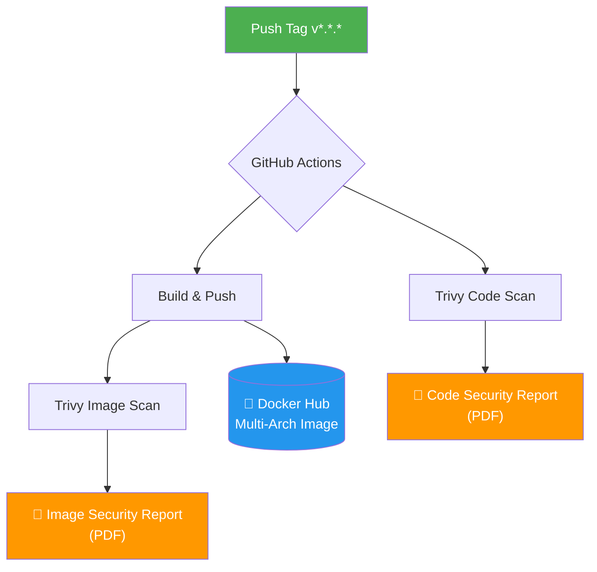

# 🐳 GitHub Template - CI/CD Docker Pipeline

[](https://github.com/YOUR_USERNAME/github-template/actions/workflows/docker-publish.yml)
[](https://trivy.dev/)
[](https://www.docker.com/)

Template de repositorio GitHub con pipeline CI/CD preconfigurado para construcción y publicación de imágenes Docker multi-arquitectura con análisis de seguridad integrado.

---

## 📋 Tabla de Contenidos

- [Características](#-características)
- [Arquitectura del Pipeline](#-arquitectura-del-pipeline)
- [Requisitos Previos](#-requisitos-previos)
- [Configuración Rápida](#-configuración-rápida)
- [Uso](#-uso)
- [Estructura del Proyecto](#-estructura-del-proyecto)
- [Seguridad](#-seguridad)
- [Personalización](#-personalización)
- [Licencia](#-licencia)

---

## ✨ Características

| Característica | Descripción |
|----------------|-------------|
| 🏗️ **Build Multi-Arquitectura** | Soporte para `linux/amd64` y `linux/arm64` |
| 🔐 **Análisis de Seguridad** | Escaneo con Trivy para código e imágenes |
| 📦 **Docker Hub Integration** | Publicación automática en Docker Hub |
| 🏷️ **Versionado Semántico** | Tags automáticos basados en `v*.*.*` |
| 📄 **Reportes PDF** | Generación automática de reportes de vulnerabilidades |
| ⚡ **Cache Optimizado** | Cache de capas Docker para builds más rápidos |

---

## 🏛️ Arquitectura del Pipeline



### Jobs del Workflow

| Job | Descripción | Dependencias |
|-----|-------------|--------------|
| `build-and-push` | Construye y publica la imagen multi-arquitectura | Ninguna |
| `trivy-code-scan` | Analiza vulnerabilidades en el código fuente | Ninguna |
| `trivy-image-scan` | Analiza vulnerabilidades en la imagen Docker | `build-and-push` |

---

## 📋 Requisitos Previos

- Cuenta de [Docker Hub](https://hub.docker.com/)
- Repositorio GitHub
- `Dockerfile` en la raíz del proyecto

---

## ⚡ Configuración Rápida

### 1️⃣ Usar este Template

1. Haz clic en **"Use this template"** en GitHub
2. Crea un nuevo repositorio

### 2️⃣ Configurar Secrets

Navega a **Settings → Secrets and variables → Actions** y añade:

| Secret | Descripción |
|--------|-------------|
| `DOCKERHUB_USERNAME` | Tu nombre de usuario de Docker Hub |
| `DOCKERHUB_TOKEN` | Token de acceso de Docker Hub |

> 💡 **Tip:** Genera un token de acceso en [Docker Hub Security Settings](https://hub.docker.com/settings/security)

### 3️⃣ Personalizar el Workflow

Edita `.github/workflows/docker-publish.yml`:

```yaml
env:
  DOCKER_IMAGE: ${{ secrets.DOCKERHUB_USERNAME }}/tu-imagen
  PLATFORMS: linux/amd64,linux/arm64
```

---

## 🚀 Uso

### Trigger Automático

El pipeline se ejecuta automáticamente al hacer push de un tag de versión:

```bash
# Crear y publicar un tag
git tag v1.0.0
git push origin v1.0.0
```

### Trigger Manual

También puedes ejecutar el workflow manualmente desde la pestaña **Actions** en GitHub.

### Tags Generados

Para un push de `v1.2.3`, se crean los siguientes tags:

| Tag | Ejemplo |
|-----|---------|
| Versión completa | `1.2.3` |
| Major.Minor | `1.2` |
| Major | `1` |
| SHA corto | `sha-abc1234` |
| Latest | `latest` (solo en rama por defecto) |

---

## 📁 Estructura del Proyecto

```
github-template/
├── .github/
│   └── workflows/
│       └── docker-publish.yml    # Pipeline CI/CD
├── Dockerfile                     # Tu Dockerfile (requerido)
├── .dockerignore                  # Archivos a excluir del build
└── README.md                      # Este archivo
```

---

## 🔐 Seguridad

### Escaneo de Código

Trivy analiza el repositorio buscando:

- 🔓 Vulnerabilidades en dependencias
- 🔑 Secrets expuestos
- ⚙️ Misconfigurations en IaC

### Escaneo de Imagen

Después del build, Trivy analiza la imagen Docker buscando:

- 📦 Vulnerabilidades en paquetes del SO
- 📚 Vulnerabilidades en dependencias de aplicación
- 🏗️ Problemas en la configuración

### Reportes

Los reportes de seguridad se generan en formato PDF y están disponibles como **Artifacts** en GitHub Actions durante 30 días.

| Severidad | Prioridad |
|-----------|-----------|
| 🔴 CRITICAL | Requiere acción inmediata |
| 🟠 HIGH | Alta prioridad |
| 🟡 MEDIUM | Prioridad media |
| 🟢 LOW | Baja prioridad |

---

## ⚙️ Personalización

### Cambiar Plataformas

```yaml
env:
  PLATFORMS: linux/amd64,linux/arm64,linux/arm/v7
```

### Cambiar Severidades del Escaneo

```yaml
severity: 'CRITICAL,HIGH'  # Solo vulnerabilidades críticas y altas
```

### Ajustar Retención de Reportes

```yaml
retention-days: 90  # Mantener reportes por 90 días
```

### Fallar en Vulnerabilidades

```yaml
exit-code: '1'  # El job fallará si encuentra vulnerabilidades
```

---

## 📜 Licencia

Este proyecto está bajo la Licencia MIT. Consulta el archivo [LICENSE](LICENSE) para más detalles.

---

<div align="center">

**[⬆ Volver arriba](#-github-template---cicd-docker-pipeline)**

Hecho con ❤️ para la comunidad DevOps

</div>
