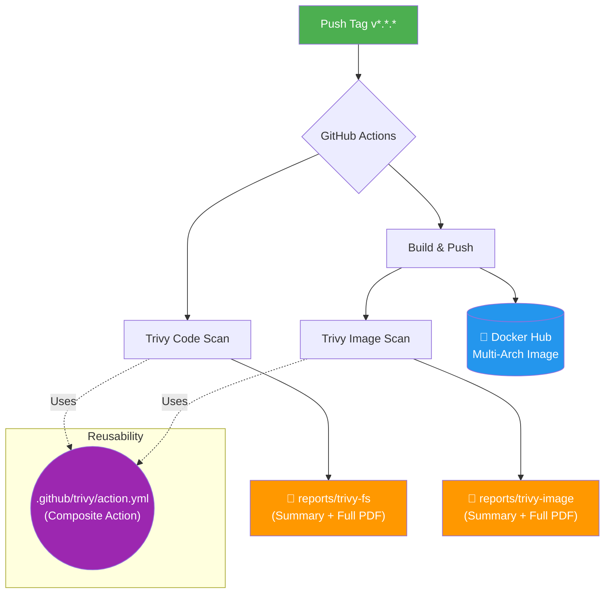

# 🐳 GitHub Template - CI/CD Docker Pipeline

[](https://github.com/YOUR_USERNAME/github-template/actions/workflows/docker-publish.yml)
[](https://trivy.dev/)
[](https://www.docker.com/)

Template de repositorio GitHub con pipeline CI/CD preconfigurado para construcción y publicación de imágenes Docker multi-arquitectura con análisis de seguridad integrado.

---

## 📋 Tabla de Contenidos

- [Características](#-características)
- [Arquitectura del Pipeline](#-arquitectura-del-pipeline)
- [Requisitos Previos](#-requisitos-previos)
- [Configuración Rápida](#-configuración-rápida)
- [Uso](#-uso)
- [Estructura del Proyecto](#-estructura-del-proyecto)
- [Seguridad](#-seguridad)
- [Personalización](#-personalización)
- [Licencia](#-licencia)

---

## ✨ Características

| 🏗️ **Build Multi-Arquitectura** | Soporte para `linux/amd64` y `linux/arm64` |
| 🔐 **Análisis de Seguridad** | Escaneo con Trivy para código e imágenes |
| 📦 **Docker Hub & GHCR** | Publicación automática en múltiples registros |
| 🏷️ **Versionado Semántico** | Tags automáticos basados en `v*.*.*` |
| 📁 **Soporte Subdirectorios** | Opción `CONTEXT_DIR` para proyectos no raíz |
| 🔍 **Detección Automática** | Identifica lenguaje y Dockerfile automáticamente |
| 📄 **Reportes PDF** | Generación automática de reportes de vulnerabilidades |
| ⚡ **Cache Optimizado** | Cache de capas Docker para builds más rápidos |

---

## 🏛️ Arquitectura del Pipeline


```mermaid
flowchart TD
    A[Push Tag v*.*.*] --> B{GitHub Actions}
    B --> C[Build & Push]
    B --> D[Trivy Code Scan]
    C --> E[Trivy Image Scan]
    
    subgraph Shared [Reusability]
        CA((".github/trivy/action.yml<br/>(Composite Action)"))
    end

    D -.-> |Uses| CA
    E -.-> |Uses| CA
    
    C --> F[("🐳 Docker Hub<br/>Multi-Arch Image")]
    D --> G["📄 reports/trivy-fs<br/>(Summary + Full PDF)"]
    E --> H["📄 reports/trivy-image<br/>(Summary + Full PDF)"]
    
    style A fill:#4CAF50,color:#fff
    style CA fill:#9C27B0,color:#fff
    style F fill:#2496ED,color:#fff
    style G fill:#FF9800,color:#fff
    style H fill:#FF9800,color:#fff
```

### Jobs del Workflow

| Job | Descripción | Dependencias |
|-----|-------------|--------------|
| `build-and-push` | Construye y publica la imagen multi-arquitectura | Ninguna |
| `trivy-code-scan` | Analiza vulnerabilidades en el código fuente | Ninguna |
| `trivy-image-scan` | Analiza vulnerabilidades en la imagen Docker | `build-and-push` |

---

## 📋 Requisitos Previos

- Cuenta de [Docker Hub](https://hub.docker.com/)
- Repositorio GitHub
- `Dockerfile` en la raíz del proyecto

---

## ⚡ Configuración Rápida

### 1️⃣ Usar este Template

1. Haz clic en **"Use this template"** en GitHub
2. Crea un nuevo repositorio

### 2️⃣ Configurar Secrets

Navega a **Settings → Secrets and variables → Actions** y añade:

| Secret | Descripción |
|--------|-------------|
| `DOCKERHUB_USERNAME` | Tu nombre de usuario de Docker Hub |
| `DOCKERHUB_TOKEN` | Token de acceso de Docker Hub |

> 💡 **Tip:** Genera un token de acceso en [Docker Hub Security Settings](https://hub.docker.com/settings/security)

### 3️⃣ Personalizar el Workflow

Edita `.github/workflows/docker-publish.yml`:

```yaml
env:
  DOCKER_IMAGE: ${{ secrets.DOCKERHUB_USERNAME }}/tu-imagen
  PLATFORMS: linux/amd64,linux/arm64
```

---

## 🚀 Uso

### Trigger Automático

El pipeline se ejecuta automáticamente al hacer push de un tag de versión:

```bash
# Crear y publicar un tag
git tag v1.0.0
git push origin v1.0.0
```

### Trigger Manual

También puedes ejecutar el workflow manualmente desde la pestaña **Actions** en GitHub.

### Reusable Workflow (Recomendado)

Si deseas usar este pipeline en otro repositorio como un workflow reutilizable:

```yaml
jobs:
  deploy:
    uses: grs89/github-template/.github/workflows/docker-build_push_auto.yml@v2
    with:
      CONTEXT_DIR: '.'  # Opcional: directorio si el código no está en la raíz
    secrets: inherit    # Hereda secretos del repo (DOCKERHUB_*, REGISTRY_*)
```

### Tags Generados

Para un push de `v1.2.3`, se crean los siguientes tags:

| Tag | Ejemplo |
|-----|---------|
| Versión completa | `1.2.3` |
| Major.Minor | `1.2` |
| Major | `1` |
| SHA corto | `sha-abc1234` |
| Latest | `latest` (solo en rama por defecto) |

---

## 📁 Estructura del Proyecto

```
github-template/
├── .github/
│   ├── trivy/
│   │   └── action.yml            # Composite Action de seguridad
│   └── workflows/
│       ├── docker-publish.yml    # Pipeline para tags (Docker Hub)
│       └── docker-build_push_auto.yml # Pipeline automático (v2)
├── Dockerfile                     # Tu Dockerfile (auto-detectado)
├── .dockerignore                  # Archivos a excluir del build
└── README.md                      # Este archivo
```

---

## 🔐 Seguridad

### Escaneo via Composite Action

Este template utiliza una **GitHub Composite Action** personalizada (`.github/trivy/action.yml`) para estandarizar el proceso de escaneo y reporte.

### Escaneo de Código e Imagen

1. **Code Scan**: Analiza el repositorio en busca de vulnerabilidades en dependencias y secretos.
2. **Image Scan**: Analiza la imagen Docker construida en busca de vulnerabilidades del SO y paquetes.

### Reportes Generados

Para cada escaneo, se generan y suben como **Artifacts**:

- 📄 **Summary PDF**: Resumen ejecutivo con gráficas y conteo de vulnerabilidades.
- 📄 **Full Report PDF**: Detalle técnico completo de cada hallazgo.
- 📊 **GitHub Step Summary**: Resumen rápido visible directamente en el workflow run.

| Severidad | Prioridad |
|-----------|-----------|
| 🔴 CRITICAL | Requiere acción inmediata |
| 🟠 HIGH | Alta prioridad |
| 🟡 MEDIUM | Prioridad media |
| 🟢 LOW | Baja prioridad |

---

## ⚙️ Personalización

### Cambiar Plataformas

```yaml
env:
  PLATFORMS: linux/amd64,linux/arm64,linux/arm/v7
```

### Cambiar Severidades del Escaneo

```yaml
severity: 'CRITICAL,HIGH'  # Solo vulnerabilidades críticas y altas
```

### Ajustar Retención de Reportes

```yaml
retention-days: 90  # Mantener reportes por 90 días
```

### Fallar en Vulnerabilidades

```yaml
exit-code: '1'  # El job fallará si encuentra vulnerabilidades
```

---

## 📜 Licencia

Este proyecto está bajo la Licencia MIT. Consulta el archivo [LICENSE](LICENSE) para más detalles.

---

<div align="center">

**[⬆ Volver arriba](#-github-template---cicd-docker-pipeline)**

Hecho con ❤️ para la comunidad DevOps

</div>
